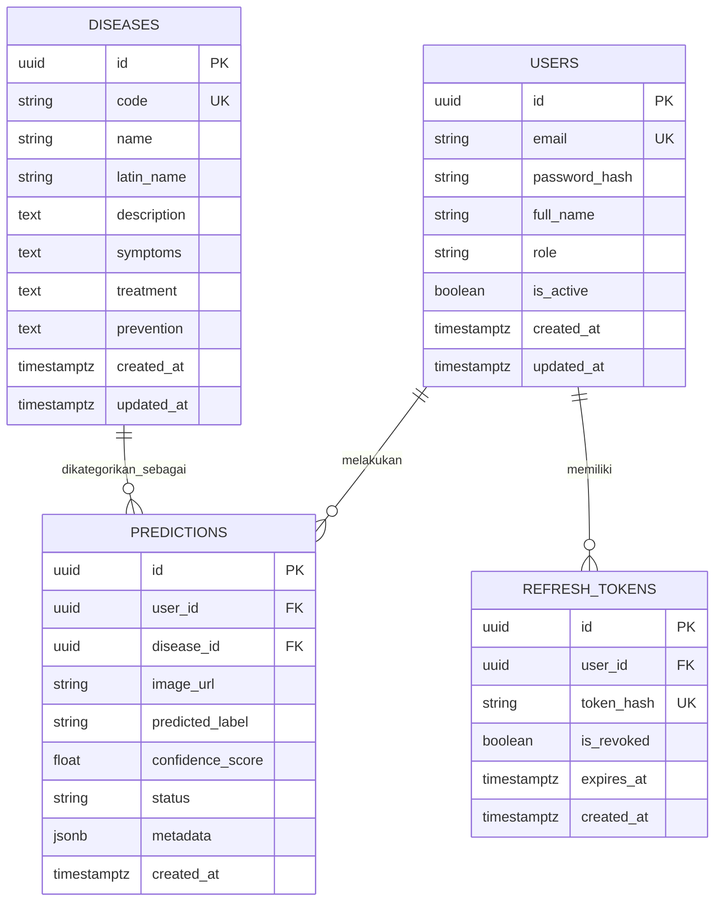

# ERD & Database Schema Specification: CassavaCare AI Backend

**Dokumen:** `erd.md`  
**Modul:** PTM-05 — Desain REST API & Pemodelan Database  
**Proyek:** CassavaCare AI Backend API  
**Versi:** 1.0.0  
**Tanggal:** 04-10-2026  

---

## 1. Pendahuluan & Ringkasan Eksekutif

Dokumen ini mendefinisikan pemodelan data relasional (Database Schema) dan Entity Relationship Diagram (ERD) untuk sistem **CassavaCare AI Backend API**. Pemodelan data ini dirancang berdasarkan kebutuhan fungsional pada **SRS (Software Requirements Specification)**, **PRD (Product Requirements Document)**, serta antarmuka yang didefinisikan pada **`api-contract.md`**. 

### 1.1 Prinsip Desain Basis Data
1. **Aturan Normalisasi (3NF):** Seluruh tabel memenuhi Third Normal Form (3NF) untuk mencegah redundansi data dan anomali pembaruan (update anomalies).
2. **Integritas Referensial (Referential Integrity):** Penggunaan Foreign Key dengan klausul `ON DELETE RESTRICT` dan `ON DELETE SET NULL` yang jelas demi menjaga konsistensi riwayat prediksi.
3. **Optimasi Kueri AI & Histori:** Penambahan indeks majemuk (composite index) pada kolom `user_id` dan `created_at` untuk mendukung kueri paginasi riwayat prediksi berkecepatan tinggi (< 100ms).
4. **Keamanan & Privasi Data (OWASP):** Tidak menyimpan kata sandi plain-text (menggunakan `password_hash`), serta mengisolasi data riwayat antar pengguna berdasarkan `user_id`.

---

## 2. Entity Relationship Diagram (ERD)

Berikut adalah diagram relasi antarentitas (ERD) menggunakan sintaks **Mermaid.js**:



---

## 3. Spesifikasi Detail Tabel & Kamus Data

### 3.1 Tabel `users`
Tabel ini menyimpan data kredensial dan profil pengguna aplikasi (petani/ekstensi lapangan).

| Nama Kolom | Tipe Data | Constraint | Deskripsi |
| :--- | :--- | :--- | :--- |
| `id` | UUID | PRIMARY KEY, DEFAULT `gen_random_uuid()` | Identifier unik pengguna |
| `email` | VARCHAR(255) | UNIQUE, NOT NULL | Alamat email pengguna untuk login |
| `password_hash` | VARCHAR(255) | NOT NULL | Hash kata sandi (Argon2id / Bcrypt) |
| `full_name` | VARCHAR(100) | NOT NULL | Nama lengkap pengguna |
| `role` | VARCHAR(20) | NOT NULL, DEFAULT `'FARMER'` | Peran pengguna (`FARMER`, `EXPERT`, `ADMIN`) |
| `is_active` | BOOLEAN | NOT NULL, DEFAULT `TRUE` | Status aktif akun |
| `created_at` | TIMESTAMPTZ | NOT NULL, DEFAULT `NOW()` | Waktu pendaftaran akun |
| `updated_at` | TIMESTAMPTZ | NOT NULL, DEFAULT `NOW()` | Waktu pembaruan profil terakhir |

---

### 3.2 Tabel `refresh_tokens`
Tabel ini mengelola token penyegaran (refresh token) JWT untuk mendukung otentikasi *stateless* namun tetap dapat dicabut (*revocable session*).

| Nama Kolom | Tipe Data | Constraint | Deskripsi |
| :--- | :--- | :--- | :--- |
| `id` | UUID | PRIMARY KEY, DEFAULT `gen_random_uuid()` | Identifier unik token |
| `user_id` | UUID | FOREIGN KEY (`users.id`) ON DELETE CASCADE | ID pengguna pemilik token |
| `token_hash` | VARCHAR(255) | UNIQUE, NOT NULL | Hash sha256 dari refresh token |
| `is_revoked` | BOOLEAN | NOT NULL, DEFAULT `FALSE` | Penanda apakah token telah dicabut |
| `expires_at` | TIMESTAMPTZ | NOT NULL | Waktu kadaluarsa token |
| `created_at` | TIMESTAMPTZ | NOT NULL, DEFAULT `NOW()` | Waktu pembuatan token |

---

### 3.3 Tabel `diseases`
Katalog rujukan jenis penyakit dan hama daun singkong berdasarkan dataset AI & pakar agronomis.

| Nama Kolom | Tipe Data | Constraint | Deskripsi |
| :--- | :--- | :--- | :--- |
| `id` | UUID | PRIMARY KEY, DEFAULT `gen_random_uuid()` | Identifier unik entitas penyakit |
| `code` | VARCHAR(20) | UNIQUE, NOT NULL | Kode standar penyakit (`CMD`, `CBSD`, `BLS`, `GMD`, `RMD`, `HEALTHY`) |
| `name` | VARCHAR(100) | NOT NULL | Nama umum penyakit (misal: *Cassava Mosaic Disease*) |
| `latin_name` | VARCHAR(100) | NULLABLE | Nama ilmiah agen penyebab penyakit |
| `description` | TEXT | NOT NULL | Penjelasan umum mengenai penyakit |
| `symptoms` | TEXT | NOT NULL | Gejala visual yang muncul pada daun |
| `treatment` | TEXT | NOT NULL | Panduan penanganan & tindakan korektif |
| `prevention` | TEXT | NOT NULL | Langkah-langkah pencegahan penyebaran |
| `created_at` | TIMESTAMPTZ | NOT NULL, DEFAULT `NOW()` | Waktu data dibuat |
| `updated_at` | TIMESTAMPTZ | NOT NULL, DEFAULT `NOW()` | Waktu data diperbarui |

---

### 3.4 Tabel `predictions`
Tabel ini menyimpan seluruh rekaman hasil inferensi model AI Computer Vision dari citra daun singkong yang diunggah pengguna.

| Nama Kolom | Tipe Data | Constraint | Deskripsi |
| :--- | :--- | :--- | :--- |
| `id` | UUID | PRIMARY KEY, DEFAULT `gen_random_uuid()` | Identifier unik transaksi prediksi |
| `user_id` | UUID | FOREIGN KEY (`users.id`) ON DELETE CASCADE | ID pengguna yang melakukan diagnosa |
| `disease_id` | UUID | FOREIGN KEY (`diseases.id`) ON DELETE SET NULL, NULLABLE | FK ke katalog penyakit (NULL jika *LOW_CONFIDENCE* / gagal) |
| `image_url` | VARCHAR(500) | NOT NULL | URI/Path lokasi penyimpanan gambar daun |
| `predicted_label` | VARCHAR(20) | NOT NULL | Label hasil inferensi model AI |
| `confidence_score` | FLOAT | NOT NULL | Nilai keyakinan model AI ($0.00 - 1.00$) |
| `status` | VARCHAR(20) | NOT NULL | Status diagnosa (`CONFIDENT`, `LOW_CONFIDENCE`, `FAILED`) |
| `metadata` | JSONB | NULLABLE | Metadata tambahan (misal: model_version, inference_time_ms, device_model) |
| `created_at` | TIMESTAMPTZ | NOT NULL, DEFAULT `NOW()` | Waktu diagnosa dilakukan |

---

## 4. DDL SQL (Data Definition Language) & Indeks Optimasi

Berikut adalah skema DDL PostgreSQL lengkap beserta perintah pembuatan indeks untuk mengoptimalkan performa kueri backend:

```sql
-- Enable Extension UUID
CREATE EXTENSION IF NOT EXISTS "uuid-ossp";

-- 1. Tabel Users
CREATE TABLE users (
    id UUID PRIMARY KEY DEFAULT gen_random_uuid(),
    email VARCHAR(255) NOT NULL UNIQUE,
    password_hash VARCHAR(255) NOT NULL,
    full_name VARCHAR(100) NOT NULL,
    role VARCHAR(20) NOT NULL DEFAULT 'FARMER',
    is_active BOOLEAN NOT NULL DEFAULT TRUE,
    created_at TIMESTAMPTZ NOT NULL DEFAULT NOW(),
    updated_at TIMESTAMPTZ NOT NULL DEFAULT NOW()
);

-- 2. Tabel Refresh Tokens
CREATE TABLE refresh_tokens (
    id UUID PRIMARY KEY DEFAULT gen_random_uuid(),
    user_id UUID NOT NULL REFERENCES users(id) ON DELETE CASCADE,
    token_hash VARCHAR(255) NOT NULL UNIQUE,
    is_revoked BOOLEAN NOT NULL DEFAULT FALSE,
    expires_at TIMESTAMPTZ NOT NULL,
    created_at TIMESTAMPTZ NOT NULL DEFAULT NOW()
);

-- 3. Tabel Diseases
CREATE TABLE diseases (
    id UUID PRIMARY KEY DEFAULT gen_random_uuid(),
    code VARCHAR(20) NOT NULL UNIQUE,
    name VARCHAR(100) NOT NULL,
    latin_name VARCHAR(100),
    description TEXT NOT NULL,
    symptoms TEXT NOT NULL,
    treatment TEXT NOT NULL,
    prevention TEXT NOT NULL,
    created_at TIMESTAMPTZ NOT NULL DEFAULT NOW(),
    updated_at TIMESTAMPTZ NOT NULL DEFAULT NOW()
);

-- 4. Tabel Predictions
CREATE TABLE predictions (
    id UUID PRIMARY KEY DEFAULT gen_random_uuid(),
    user_id UUID NOT NULL REFERENCES users(id) ON DELETE CASCADE,
    disease_id UUID REFERENCES diseases(id) ON DELETE SET NULL,
    image_url VARCHAR(500) NOT NULL,
    predicted_label VARCHAR(20) NOT NULL,
    confidence_score FLOAT NOT NULL CHECK (confidence_score >= 0.0 AND confidence_score <= 1.0),
    status VARCHAR(20) NOT NULL CHECK (status IN ('CONFIDENT', 'LOW_CONFIDENCE', 'FAILED')),
    metadata JSONB,
    created_at TIMESTAMPTZ NOT NULL DEFAULT NOW()
);

-- Indeks Optimasi Performa
CREATE INDEX idx_users_email ON users(email);
CREATE INDEX idx_refresh_tokens_user ON refresh_tokens(user_id);
CREATE INDEX idx_diseases_code ON diseases(code);
CREATE INDEX idx_predictions_user_created ON predictions(user_id, created_at DESC);
CREATE INDEX idx_predictions_status ON predictions(status);
```

---

## 5. Analisis Normalisasi Basis Data (3NF Audit)

1. **First Normal Form (1NF):**
   - Setiap kolom berisikan nilai atomik (atomic value).
   - Tidak ada daftar berpola koma atau array majemuk pada atribut utama. Atribut `metadata` berformat `JSONB` difungsikan sebagai kontainer informasi non-kritis pendukung (*non-queryable metadata*).
2. **Second Normal Form (2NF):**
   - Seluruh tabel menggunakan kunci utama tunggal (`id` tipe UUID).
   - Tidak ada ketergantungan parsial (partial dependency); seluruh atribut non-kunci bergantung sepenuhnya pada kunci utama (`PRIMARY KEY`).
3. **Third Normal Form (3NF):**
   - Tidak terdapat ketergantungan transitif (transitive dependency). Atribut rekomendasi penanganan (`treatment`) pada `predictions` diakses secara dinamis melalui relasi Foreign Key ke entitas `diseases`, sehingga pembaruan informasi medis penyakit hanya dilakukan pada satu tempat.

---

## 6. Matriks Penelusuran (Traceability Matrix)

| Kebutuhan SRS / PRD | Fitur API | Entitas Basis Data | Kolom Terlibat |
| :--- | :--- | :--- | :--- |
| **FR-01** (Autentikasi Pengguna) | `POST /auth/signup`, `POST /auth/login` | `users`, `refresh_tokens` | `users.email`, `users.password_hash`, `refresh_tokens.token_hash` |
| **FR-02** (Diagnosa Citra AI) | `POST /predictions` | `predictions`, `diseases` | `predictions.image_url`, `predictions.confidence_score`, `predictions.status` |
| **BR-01 / AC-02** (Thresh 70%) | Logic Handler Inferences | `predictions` | `predictions.status` (`CONFIDENT` vs `LOW_CONFIDENCE`) |
| **FR-03** (Katalog Penyakit) | `GET /diseases`, `GET /diseases/{id}` | `diseases` | `diseases.code`, `diseases.symptoms`, `diseases.treatment` |
| **FR-04** (Riwayat Prediksi) | `GET /predictions`, `GET /predictions/{id}` | `predictions` | `predictions.user_id`, `predictions.created_at` |

---

## 7. Catatan Asumsi Desain Basis Data `[ASUMSI-XX]`

- **`[ASUMSI-04]` Keterhubungan `disease_id` pada Prediksi Low Confidence:** Pada hasil prediksi dengan status `LOW_CONFIDENCE` (keyakinan < 0.70), kolom `disease_id` diisi `NULL` karena sistem belum dapat mengonfirmasi diagnosa secara pasti, namun `predicted_label` tetap dicatat untuk keperluan audit performa model AI.
- **`[ASUMSI-05]` Format UUID v4:** Seluruh Primary Key menggunakan standar UUID v4 untuk mencegah peretasan numerik terurut (*Enumeration Attack / OWASP API1:2023 BOLA*) dan memudahkan *offline sync* di masa mendatang.
- **`[ASUMSI-06]` Penggunaan JSONB Metadata:** Kolom `metadata` pada tabel `predictions` menyimpan informasi teknis seperti versi model ONNX/TFLite, durasi inferensi, dan spesifikasi perangkat pengguna tanpa membebani skema relasional utama.
